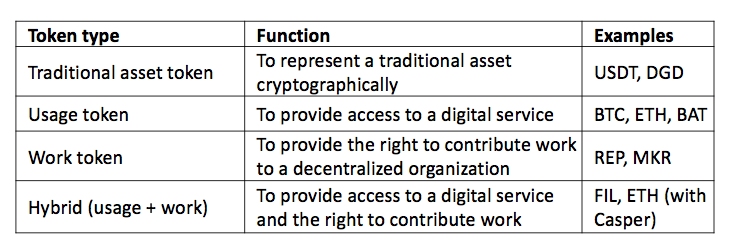

Initial [coin](https://www.coindesk.com/bitcoin-explained-global-currency-wall-street-veteran/), [commodity](http://www.cftc.gov/PressRoom/PressReleases/pr7231-15), [security](https://www.sec.gov/news/press-release/2017-131), or [token](https://news.21.co/thoughts-on-tokens-436109aabcbe?gi=6bae346bbfdd) offerings, really whatever you want to call them, have become a massive global phenomenon. According to many in the blockchain community we are at peak ICO, with plenty of projects raising over 7 figures for little more than a whitepaper and over $1.8 billion in total funds raised. However, amidst the chaos, there are some teams are keeping focused and designing protocols that will fundamentally transform how value is generated, tracked, and transferred in the 21st century.

So how can we make sure that the teams being funded amidst the ICO hype are those building the future and not those building their bank accounts?

First, although there are some obvious reasons, let's answer the question of why we should care.

## A Market For Lemons

While it might sound satisfying to some to say that, even if it's funding low-quality projects more often than not, the market is working as intended we view this as fundamentally misguided. Not only is the current system incredibly inefficient from a capital allocation perspective, it poses an existential risk to any blockchain that allows for token ecosystems. As outlined in George Akerlof's famous paper "The Market for Lemons: Quality Uncertainty and the Market Mechanism" the presence of inferior goods along with a few other conditions will eventually drive a market out of existence. The four core criteria for a lemon market are as follows:

1) An asymmetry of information;

2) An incentive for sellers to pass off low-quality products as high quality;

3) A continuum of seller qualities exist; and

4) No recourse for purchases of low-quality products.

While we believe it is easy to see that ICO markets satisfy these criteria, [this article](https://medium.com/@avtarsehra/icos-and-economics-of-lemon-markets-96638e86b3b2) by Avtar Sehra does a much better job of explaining the similarities between ICOs and lemons.

In addition, even in cases where ICO offerings are made in good faith, with real potential for quality, the instant liquidity provided by most token offerings can actually distract from building the underlying protocol or application. In fact, this is precisely why [companies that raise too much money too quickly](https://www.fastcompany.com/3057027/the-case-against-startups-raising-as-much-money-as-humanly-possible) are more likely to fail.

If we really want to ensure that valuable projects in the ecosystem continue to get funding then, we need better mechanisms to ensure funds go to the right teams.

## The Current State of ICO Due Diligence

The ecosystem around ICOs has evolved significantly over the past two years, with an ever increasing list of ICO news and research outlets emerging. But at its core the current process for evaluating ICOs typically involves looking at the same three metrics any early-stage investor looks at: team, product, and market.

### Team

>I don’t know what a business is. All a company is is a bunch of people together to create a product or service. There’s no such thing as a business, just pursuit of a goal—a group of people pursuing a goal.
~Elon Musk

Team is the only metric that can be directly assessed at any stage of a company’s life. It’s hard to know much about a product that hasn’t been built or a market that hasn’t been explored, but before there’s anything there’s a team. In some cases VCs will almost entirely ignore product and market on the assumption that a good team with neither will solve the problem while a bad team with both will squander the opportunity.

The importance of teams isn’t to say that founders need to be a group of MIT graduates with 10 years or more of experience in the domain they’re exploring because [even they can forget to change their passwords](https://www.wired.com/story/enigma-ico-ethereum-heist/). However, a good team should always display passion, integrity, and adaptability. Most of these are tired and often nebulous concepts, but they define what you’ll hear from almost any established early-stage VC and (consequently) what you’ll read in almost any ICO report today.

### Product

>I don't have a quote for here, and whether I should have included quotes in the other two sections is frankly in question.
>~Me

If we agree with Elon’s description above we agree that every company starts with a team and an idea or goal, but they don’t always (or often) start with a product. Of course, as any bad motivational poster will tell you, building a product is 1% inspiration and 99% perspiration. And as anyone who’s managed a project before knows, there’s a long road between starting a project and actually building out its core features. As might be expected that road starts with planning out what those core features are, breaking them down into manageable milestones, prioritizing, and planning resources accordingly.

Naturally then, the first step in evaluating a product is to ask the question: does the team have a product? If they do, great, you can evaluate the product on its merits. If they don’t (like many projects in the blockchain ecosystem), the question really comes back to whether or not the team has a clearly defined vision and the ability to execute on that vision. In the ICO world determining this is still done in a relatively information fashion, through reading whitepapers, and talking with founders.

### Market

>In a great market — a market with lots of real potential customers — the market pulls product out of the startup.
~Marc Andreesen

While every company has to have a team, and is at working on building or selling something that at least vaguely resembles a product or service, not every company has to have a market. In fact, plenty of companies throughout history haven’t had any market at all. Those companies don’t exist anymore.

The fundamental importance of market in the discussion of product-market fit has led some like Andy Rachleff, formerly of Benchmark Capital, to the conclusion that market is actually the most important thing to look for in a startup. ‘Rachleff’s Law’ as he calls it (like many VCs Andy was known for his humility) is as follows:

- When a great team meets a lousy market, market wins.
- When a lousy team meets a great market, market wins.
- When a great team meets a great market, something special happens.

In short what Andy was trying to get at is that neither a good team or a 'good' product will fix having no market for what you're offering. Companies that listen to customers and let the market's needs drive their product are far more likely to succeed.

### Crypto-Specific Considerations

There are also a few other metrics that have to be considered in light of the fact that blockchain investments are often investments in tokens that power protocols and applications. Some of these questions are as follows:

**1) What does the token do and what are the token economics?**

This might be hard for some to hear but [not everything needs to be a token](https://medium.com/@bryn.bellomy/not-every-app-needs-a-coin-69305aecb43f). However, with the current hype around ICOs everything is becoming one. Understanding what a token does and why those functions can’t be managed by an existing token (or to go further, why the platform or service benefits from decentralization) is critical. Note that this isn't to say that tokens are inherently bad - tokens that provide the right incentives and utility can create more robust and stable ecosystems.

As [Nick Tomaino of Rune Capital points out](https://thecontrol.co/on-token-value-e61b10b6175e), there are really four major kinds of tokens: traditional asset tokens, usage tokens, work tokens, and hybrid tokens.

Understanding which of these categories (though they're really just one of many ways to partition the ecosystem) can be a useful starting point in defining what a given token is actually meant to do, but fundamentally the end goal is to understand exactly how the token functions in the ecosystem.

**2) What do the sale terms look like?**

Looking into the terms and conditions associated with a product you're buying or a project you're funding isn't a new idea, but the way this process works in the case of token sales has some unique features. Most importantly, because tokens make it so easy to build exchange mechanisms there are many ways to sell a token, and some of these ways are better than others. As Vitalik outlined in [his post on token sale models earlier this summer](http://vitalik.ca/general/2017/06/09/sales.html), a variety of models have been tried including hybrid capped sales, reverse dutch auctions, Vickrey auctions, and proportional refunds. Rather than reinvent the wheel we strongly recommend you take a look at Vitalk's post for some great insights into what some best practices for token sales might look like.

## Fixing The Market

So clearly there are some very simple core questions we can ask about blockchain projects to get a general idea of whether they make sense to contribute to. And while we'd like to believe that most people already ask these questions and that these questions are sufficient, in a space with this much hype, and where so much is on the line if bad projects get funded more is required. In particular we believe that:

a) more accessible, real-time data is needed to help investors or contributors to make sound decisions about where to put their money; and more importantly

b) a way outside of founder promises is required to ensure that funding is predicated on tangible milestones.

That last point isn't anything new by the way. Almost all standard angel and venture capital funding is already contingent on specific results being achieved by the company being funded. Crazy, right?

These are problems we think GitToken can help solve by tying code - which we believe makes up the majority of the work in building new protocols and applications - to token issuance.

## Proof of Code: Using GitToken to Tie Cash to Contributions

At its core GitToken is a very simple idea: People should be rewarded for what they do and not what they say.

GitToken allows any project to show its commitment to code by tying its fundraising to specific GitHub events and milestones. Projects using GitToken can assure contributors that their donations are being put directly towards tangible roadmap items without any middleman allocating the funds. Moreover, GitToken allows project owners to better manage their projects and incentivize their teams to put in the effort required to make the project a success.

Given the risks to the ecosystem we outlined above, we want to strongly encourage blockchain projects in particular to use GitToken to build trust in the community and to tie their commitments to their contributors directly to the blockchain.

## Using GitToken for ICO Due Diligence

Although ecosystem around due diligence for ICOs has improved significantly over the last 12 months, our discussions with the community lead us to believe that many contributors are still failing to look at the code a project has actually written. In some cases this may just be a matter of laziness, but we understand that reviewing code can be time consuming and difficult for those coming from a non-technical background (which many ICO investors are).

GitToken intends to make it easy for anyone to get an idea of how much work a team is doing by providing an accurate and up-to-date feed of how project members are interacting with their GitHub repositories. In the alpha version of our software there are still many ways these metrics can be manipulated, and so we recommend that users proceed with caution. However, we hope that as GitToken matures it will become the standard for reviewing the work ethic and technical competence of a blockchain team.

If you'd like to get involved, feel free to open an issue, submit a pull request, or chat with us on Gitter.
