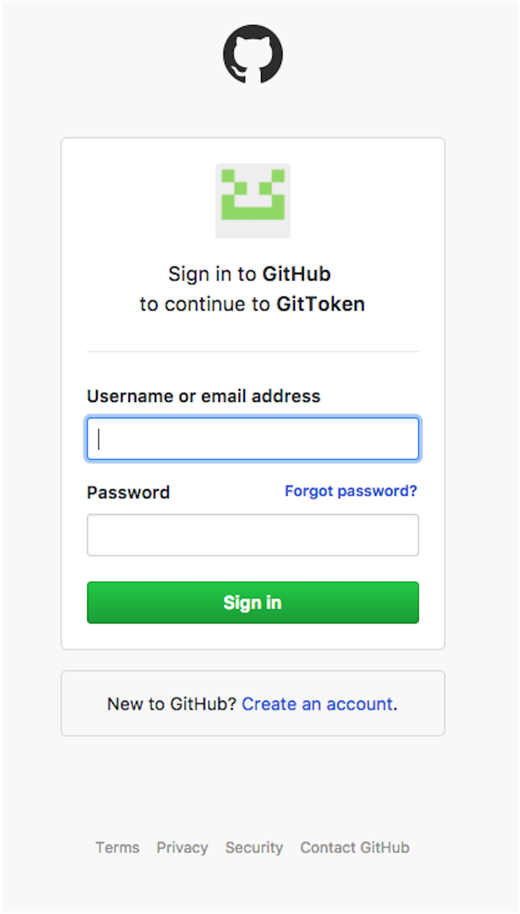
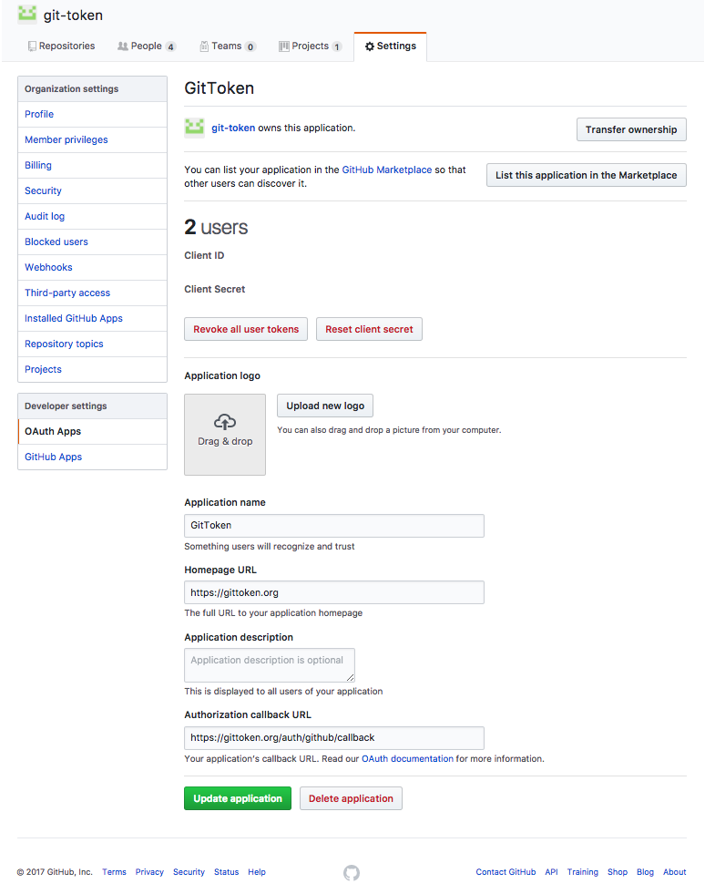

## GitHub Open Authorization (OAuth)

To receive tokens, contributors must verify her/his identity with the organization's GitToken contract.

The GitToken server instance provides a GitHub OAuth endpoint for contributors to authenticate themselves with the organization's GitToken contract instance.

Additionally, GitToken provides a web application user interface to enable contributors to easily verify their identity.

By default authentication requests are handled by the GitToken server at the `/auth/github` endpoint.[^GitTokenAuth]

A contributor verifies her/his identity by associating an Ethereum address to her/his OAuth GitHub credentials using the provided GitToken web application or desktop user interface(s).

The contributor's GitHub login session is stored by the GitToken Express application.

Using GitHub's OAuth strategy to authenticate contributors enables the GitToken services to map the Ethereum address of the contributor to the contributor's GitHub username, thereby successfully configuring the service to distribute tokens to the contributor when GitHub web hook events are triggered.

### Configure a GitHub OAuth Application

To configure GitHub Open Authorization for a GitToken server instance, click **settings** under the organization's main GitHub landing page. Select **OAuth Apps** on the left side navigation section.

Create a new OAuth application for the GitToken application. The configuration requires an **Authorization Callback URL**. This URL is provided by the GitToken server instance at the endpoint `/auth/github/callback`.[^GitTokenCallback]

Enter the full callback URL for the organization in the provided field. For example, `https://organization.website/auth/github/callback`

[^GitTokenAuth]: e.g., The authentication endpoint for [GitToken](https://GitToken.org)'s GTK contract is [`https://GitToken.org/auth/github`](https://GitToken.org/auth/github).
[^GitTokenCallback]: e.g., The authorization callback url endpoint for [GitToken](https://GitToken.org)'s GTK contract is [`https://GitToken.org/auth/github/callback`](https://GitToken.org/auth/github/callback).
