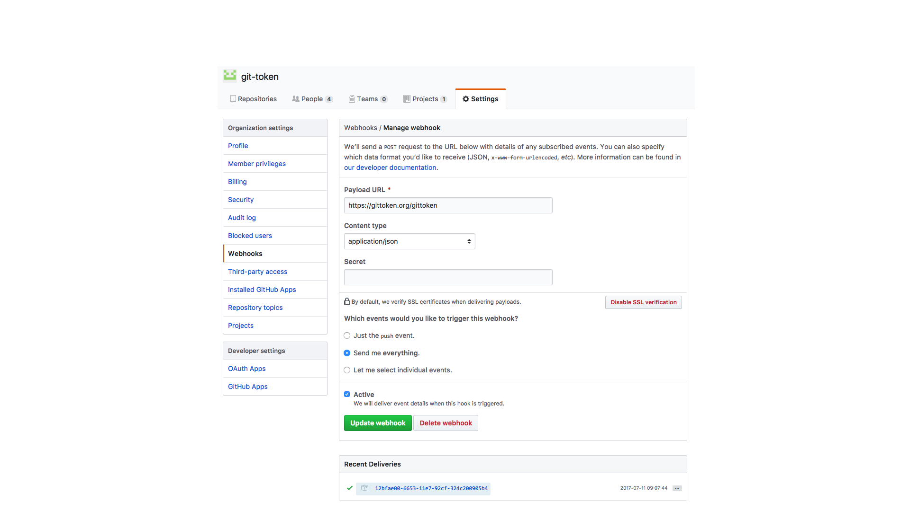

<!-- toc orderedList:0 depthFrom:1 depthTo:6 -->

* [Introduction](#introduction )
* [Git Contributions](#git-contributions )
    * [GitHub Webhook Events](#github-webhook-events )
        * [Configuring A Webhook](#configuring-a-webhook )
            * [Ping Event](#ping-event )
        * [Event Types](#event-types )
* [GitTokens](#gittokens )
    * [Contracts](#contracts )
        * [GitToken.sol](#gittokensol )
        * [GitTokenLib.sol](#gittokenlibsol )
* [Token Auctioneering](#token-auctioneering )
    * [Evaluation of Open Source Projects](#evaluation-of-open-source-projects )
* [Authentication](#authentication )
* [References](#references )

<!-- tocstop -->


---
references:
- id: octoverse
  author:
    - family: GitHub et. al.
  title: The state of the Octoverse 2016
  container-title: 'https://octoverse.github.com/'
  accessed:
    year: 2016
    month: 12
    day: 31
- id: github2017
  author:
    - family: GitHub et. al.
  title: Celebrating nine years of GitHub with an anniversary sale
  container-title: 'https://github.com/blog/2345-celebrating-nine-years-of-github-with-an-anniversary-sale'
  accessed:
    year: 2017
    month: 7
    day: 12
- id: Buterin2017
  author:
    - family: Buterin et. al.
  title: A Next-Generation Smart Contract and Decentralized Application Platform
  container-title: 'https://github.com/ethereum/wiki/wiki/White-Paper'
  accessed:
    year: 2017
    month: 7
    day: 12
- id: git2017
  author:
    - family: Git, et. al.
  title: gitworkflows - An overview of recommended workflows with Git
  container-title: 'https://git-scm.com/docs/gitworkflows'
  accessed:
    year: 2017
    month: 7
    day: 11
- id: gnosis2017
  author:
    - family: Aitken
  title: Gnosis' Prediction Market Scores $12.5M In 'Record-Breaking' Crypto Auction
  container-title: 'https://www.forbes.com/sites/rogeraitken/2017/04/24/gnosis-prediction-market-scores-12-5m-in-record-breaking-crypto-auction/#3afec93ce87d'
  accessed:
    year: 2017
    month: 7
    day: 11
---
# Introduction


Over the past 9 years GitHub has quickly become the largest host of source code in the world, managing nearly 57 million repositories and 100 million pull requests for over 26 million users. [@github2017] As the open source movement continues to gain momentum so to does the number of individual contributors to these repositories. In some cases these repositories had over 10,000 contributors. [@octoverse]

At the same time, the emergence of cryptographic networks and assets, such as Ethereum, has created new protocols for sending and managing value. Ethereum is a cryptographic network for running distributed programs; allowing users of Ethereum to send peer-to-peer (P2P) transactions and interact with smart contracts deployed on the global network.

Ethereum smart contracts are software applications written in a high-level scripting language and compiled into byte code to be run on a version of the Ethereum Virtual Machine (EVM). The EVM interprets the byte code instruction set and translates the the program into machine code to be executed. [@Buterin2017]

GitToken combines the work flows of Git version control system leveraged by GitHub's web-based source code management platform and the Ethereum network to provide a set of open-source software tools and programs to enable any GitHub user to issue their own ERC20 tokens to incentivize and reward contributors, and monitor the fundamentals of their projects by integrating token generation with git contributions.

Contributions are mapped to GitHub web hook events, and include but are not limited to, creating issues, committing code, merging branches, forking repositories, and reviewing code. GitToken provides a Docker container to deploy a server for configuring and listening to GitHub web hook events.

Contributors receive tokens through interacting with an organization that has configured a GitToken server and has setup a GitHub web hook. When a contributor creates a new event, her/his GitHub login username is provided in the web hook request. Each username is mapped to an Ethereum address in the GitToken contract.

Contributors verify their GitHub identity by authenticating into GitHub using their Open Authorization (OAuth) token credentials. Contributors authenticate themselves with the token contract using the GitToken server authentication URL associated with an organization. For example, the authentication URL for the GitToken GTK token contract is [`https://GitToken.org/auth/github`](https://GitToken.org/auth/github ). If a contributor has not yet verified their identity with the contract, their contribution rewards will be held by the contract until their identity has been verified.

The Ethereum ecosystem has adopted a de facto contract interface for transacting value on top of the Ethereum network, the ERC20 protocol.  The ERC20 protocol allows tokens to be exchanged over-the-counter (OTC) with private parties using Ethereum contracts. While the standard is still evolving, many developers have used the ERC20 token to represent utility or rights in their projects and have offered tokens to the public to raise funding for open source development. [@gnosis2017]

[GitToken](https://gittoken.org ) will offer GTK tokens to represent contributions made to the organization's GitHub [repositories](https://github.com/git-token ). A portion of tokens issued are automatically auctioned to bidders by the GitToken contract upon each event.

---
  

# Git Contributions

GitToken provides a Docker image and Dockerfile for configuring and listening to incoming GitHub contribution events via HTTP POST requests made by an organization's GitHub webhook service.

Request data is parsed and signed by the GitToken middleware handler, and sent to the GitToken contract to create and distribute tokens to contributors.

## GitHub Webhook Events

### Configuring a Webhook

> We’ll send a POST request to the URL below with details of any subscribed events. You can also specify which data format you’d like to receive. More information can be found in our [developer documentation](https://developer.github.com/webhooks/ ).

Under the **settings** tab in an organization's GitHub dashboard, click **Webhook** on the left navigation section and add a new webhook.



GitToken, by default, sets the webhook endpoint to be `/gittoken`. This endpoint is customizable in the configuration file of the GitToken Docker service. [^GTKWebHook]

Enter the url of the organization's GitHub webhook endpoint in the `payload URL` field of the webhook settings page. This is the endpoint that will receive POST requests when a contribution is made to any of an organizations' repositories.

Additionally, the organization can filter for which events they would like to receive from the web hook service. The organization may wish to listen only for `push` events, or they may wish to receive individual events, or all events. GitToken provides event handling for all event types and recommends listening for all events.

#### Ping Event

The `ping` event is the first event sent by the GitHub webhook service. Its purpose is to test the endpoint configuration and, in the context of GitToken, establish the keystore and contract for the GitToken server.

The webhook service will display a checkmark if the endpoint responds with a `200` success status. A successful response will include JSON data about the keystore account, contract creation transaction receipt, and current details about the Ethereum blockchain the GitToken server is connected to.

```javascript
{
  "accounts": { ... },
  "contract": { ... },
  "blockchain": { ... }
}
```

Otherwise, the webhook service will display an error message with either a `400` or `500` error status.

Upon receiving a ping event, the GitToken server checks if a keystore and GitToken contract already exist. If either does not exist, the GitToken server attempts to create the keystore and deploy a contract with the configured parameters provided to the GitToken server instance.

One common reason a contract may not deploy may be due to inadequate funds in the Ethereum account tied to the keystore. For the purpose of the GitToken alpha on the Ropsten testnet a faucet can be used to provide the minimum amount necessary to create a contract.

The server will respond with an error message if the contract could not be created.

### Event Types

--------------------------------------------------------------------
Event                      Reward Value Description
-------------------------- ------------ -----------------------------------------
*                                     0 Any time any event is triggered (Wildcard Event).

commit_comment                      250 Any time a Commit is commented on.

create                             2500 Any time a Branch or Tag is created.

delete                                0 Any time a Branch or Tag is deleted.

deployment                         5000 Any time a Repository has a new deployment created from the API.

deployment_status                   100 Any time a deployment for a Repository has a status update from the API.

fork                               5000 Any time a Repository is forked.

gollum                              250 Any time a Wiki page is updated.

installation                        250 Any time a GitHub App is installed or uninstalled.

installation_repositories          1000 Any time a repository is added or removed from an installation.

issue_comment                       250 Any time a comment on an issue is created, edited, or deleted.

issues                              500 Any time an Issue is assigned, unassigned, labeled, unlabeled, opened, edited, milestoned, demilestoned, closed, or reopened.

label                               100 Any time a Label is created, edited, or deleted.

marketplace_purchase                  0 Any time a user purchases, cancels, or changes their GitHub Marketplace plan.

member                             1000 Any time a User is added or removed as a collaborator to a Repository, or has their permissions modified.

membership                         1000 Any time a User is added or removed from a team. Organization hooks only.

milestone                         15000 Any time a Milestone is created, closed, opened, edited, or deleted.

organization                       1000 Any time a user is added, removed, or invited to an Organization. Organization hooks only.

org_block                             0 Any time an organization blocks or unblocks a user. Organization hooks only.

page_build                          500 Any time a Pages site is built or results in a failed build.

project_card                        250 Any time a Project Card is created, edited, moved, converted to an issue, or deleted.

project_column                       50 Any time a Project Column is created, edited, moved, or deleted.

project                            1000 Any time a Project is created, edited, closed, reopened, or deleted.

public                            10000 Any time a Repository changes from private to public.

pull_request_review_comment         250 Any time a comment on a pull request's unified diff is created, edited, or deleted (in the Files Changed tab).

pull_request_review                 100 Any time a pull request review is submitted, edited, or dismissed.

pull_request                       1000 Any time a pull request is assigned, unassigned, labeled, unlabeled, opened, edited, closed, reopened, or synchronized (updated due to a new push in the branch that the pull request is tracking). Also any time a pull request review is requested, or a review request is removed.

push                               1000 Any Git push to a Repository, including editing tags or branches. Commits via API actions that update references are also counted. This is the default event.

repository                         2500 Any time a Repository is created, deleted (organization hooks only), made public, or made private.

release                            5000 Any time a Release is published in a Repository.

status                              200 Any time a Repository has a status update from the API

team                               2000 Any time a team is created, deleted, modified, or added to or removed from a repository. Organization hooks only

team_add                           2000 Any time a team is added or modified on a Repository.

watch                               500 Any time a User stars a Repository.
--------------------------------------------------------------------


[^GTKWebHook]: e.g., the webhook endpoint for [GitToken](https://github.com/git-token )'s repositories is `https://GitToken.org/gittoken`
  

# GitTokens
  

## Contracts

### [GitToken.sol](https://github.com/git-token/contracts/blob/master/contracts/GitToken.sol )
### [GitTokenLib.sol](https://github.com/git-token/contracts/blob/master/contracts/GitTokenLib.sol )
  

# Token Auctioneering

Ethereum ERC20 tokens have recently provided a new mechanism for funding projects. While tokens have brought liquidity to start-ups, it has also brought mis-pricing and speculation.

Many of the projects that have offered tokens to build their projects have used Git and GitHub to manage and develop software collaboratively, yet independently.

There is a clear relationship between the number of git contributions a project has and the market capitalization of the project.
  

---
references:
- id: git-scm2017
  author:
    - family: Git, et. al.
  title: gitworkflows - An overview of recommended workflows with Git
  container-title: 'https://git-scm.com/docs/gitworkflows'
  accessed:
    year: 2017
    month: 7
    day: 11
---
<script src="https://cdn.plot.ly/plotly-latest.min.js"></script>
### Evaluation of Open Source Projects

```javascript
TESTER = document.getElementById('test')
Plotly.plot(TESTER, [{
  x: [38438497236, 18401040701, 1376206596, 235578951, 228864420, 87398581, 56423927],
  y: [14409, 8680, 8299, 3958, 258, 1492, 706],
  name: 'Contributions',
  text: ['Bitcoin', 'Ethereum', 'Ethereum Classic', 'Golem', 'Gnosis', 'Status', 'Aragon'],
  textposition: 'top center',
  marker: {
    size: [38.43, 18.40, 1.37, .23, .22, .08, .05]
  },
  mode: 'markers+text'
}],{
  height: 600,
  margin: { t: 100, l: 50 },
  title: 'Git Commits Vs. Market Capitalization'
});


```
```
Error: DOM element provided is null or undefined
```


GitToken maps the total supply of the token to contributions made to the project.
  

# Authentication

A contributor verifies their identity by associating an Ethereum address to their OAuth GitHub credentials using the web application user interface.
  

# References
  
